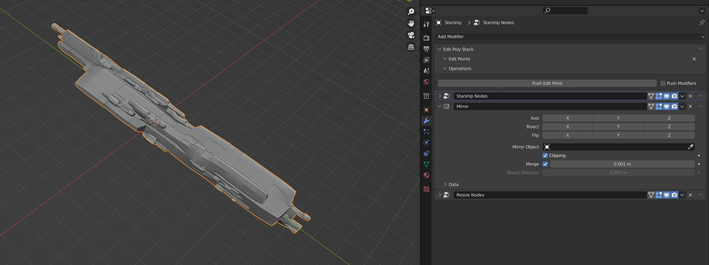
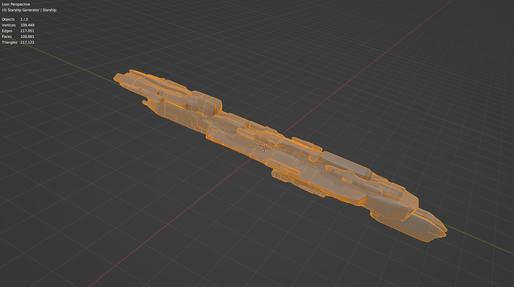

######################
Controls
######################

Click on the *Starship* object to select it, and navigate to the *Modifiers* tab.  You'll see a set of modifiers that are used to generate the object.  Most are backed by Blender's |Geometry Nodes|. Key parameters are exposed in the UI for you to control:

************************************************************
Starship Controls Modifier
************************************************************

This sets any overall controls for the Starship.

* **Seed:** This is the number that controls the random generation of the entire object.  Changing this number changes the entire starship configuration. It passes on the seed to all other modifiers through the *seed_attr* attribute.  

    .. tip:: 
        .. image:: images/seed_attr_input.jpg

        If you see the word *seed_attr* against a parameter in other modifiers, it is using the seed parameter attribute defined in the *Starship Controls Modifier*.

        .. image:: images/seed_attr_toggle1.jpg

        You can toggle between using this seed parameter attribute and using an individual numerical value for the modifier by clicking the "Input Attribute Toggle" button next to the parameter in the modifier you want to change:
        
        .. image:: images/seed_attr_toggle2.jpg

        Doing this will allow you to control a modifier's randomness separately to other modifiers.  For instance, you may wish to control the *Panels* modifier separately.

* **Min Scale**: Minimum Scale of the randomly generated objects.
* **Max Scale**: Maximum Scale of the randomly generated objects.
* **Min Extrusion**: Minimum Extrusions created in the generated objects.
* **Max Extrusion**: Maximum Extrusions created in the generated objects.
* **Min Taper**: Minimum Extrude Taper in the generated objects.
* **Max Taper**: Maximum Extrude Taper in the generated objects.
* **Object Octree Depth**: This changes the detail of the Remesh in the objects. Lower values are simpler objects.
* **Object Subdivisions**: This controls number of subdivisions for the generated objects.
* **Min SubD Crease**: This controls the minimum subdivision crease for the generated objects.
* **Max SubD Crease**: This controls the maximum subdivision crease for the generated objects.

************************************************************
Big/Medium/Small Objects Modifiers
************************************************************

.. image:: images/big_medium_small_example.gif

The Starship Generator first randomly selects a *Big* object, then randomly chooses a set of *Medium* objects and scatters them around the *Big* object's surface, and then randomly chooses a set of *Small* objects and scatters them across the surface.  It then optionally adds a panelling effect to all the objects (switched on by default).

================================
Big Objects Modifier
================================

This randomly selects an object from a specified collection to be the biggest object of the starship that other objects are attached to.

* **Collection**: Which collection of objects to randomly pick from.
* **Seed**: The seed value used to randomly pick and scale an object.

================================
Medium Objects Modifier
================================

This randomly selects objects from a specified collection, resizes them to a relatively medium size compared the the *Big* object, and scatters copies of them across the surface of the main object.

* **Collection**: Which collection of objects to randomly pick from.
* **Seed**: The seed value used to randomly pick and scale an object.
* **Density**: The amount of objects to be scattered across the surface.
* **Min Scale**: The minimum scale of the objects relative to the big object.
* **Max Scale**: The maxiumum scale of the objects relative to the big object.
* **Min Offset**: This is the smallest offset from the big object face normal the object will be placed from.
* **Max Offset**: This is the largest offset from the big object face normal the object will be placed from.
* **Random Rotate Increment**: this will randomly rotate the objects at set intervals.

================================
Small Objects Modifier
================================

This randomly selects objects from a specified collection, resizes them to a relatively small size compared the the *Big* object, and scatters copies of them across the surface of the object.

The parameters are the same as the :ref:`Medium Objects Modifier` as it uses the same *Geometry Nodes*.

************************************************************
Panels Modifier
************************************************************

This adds a panelling effect to the surface of the contructed objects.  The panels are a combination of big, medium and small panels combined on top of each other to produce a varied effect. It uses 3D Voronoi Cell Noise to determine which faces are extruded.

.. note::

    When using custom object collections or material displacement, you will likely want to switch off this panelling effect.

* **Seed**: The seed value used to randomly generate different noise patterns.
* **Subdivision Level**: In order to apply the panelling effect, the object faces need to be subdivided so there is enough information to work out the pattern.  Increasing this value will increase the accuracy and smoothess of panels at the expense of calculation time when changing the object.
* **Panel Size**: This is the size of the panels.  Larger values actually result in smaller pattern details, where smaller values increase the overall size.
* **Large Panel Height/Mid Panel Height/Micro Panel Height**: These parameters control the relative heights of big, medium and smaller panel areas.
* **Panel Proportions**: This stretches the panels in the X, Y and Z axis.  A smaller Y value, for instance, will stretch the panelling effect in that direction.

.. tip::

    You could use this modifier on other objects if you wish by adding a Geometry Nodes modifier to a new object and appending the *Starship: Add Panels* node tree:

    .. image:: images/panels_modifier_imported.jpg

.. tip::

    **Jagged Panels**

    .. image:: images/jagged_panels.jpg
    
    At times, jagged panelling can occur at the corner of objects due to the way panels are created using 3D Voronoi Cell Noise.

    You can improve this by either decreasing or increasing the number of *Subdivision Levels*. Note that increasing *Subdivision Levels* is at the expense of calculation time:

    .. image:: images/jagged_panels2.jpg

************************************************************
Booster Modifier
************************************************************

.. image:: images/booster_object.jpg

This optionally adds a booster object, randomly selected from a specified collection, and projects to to the back (or the front) of an object with controls to refine its position.

* **Seed**: Numerical value that controls the randomn selection of booster objects.
* **Booster Objects**: Change the collection the booster objects are randomly picked from by changing the Booster Objects parameter.  
* **Booster Scale**: Change the size of the booster by setting the Booster Scale parameter.
* **Flip Booster? (0/1)**: You can flip the booster to either side of the Starship by changing the ‘Flip Booster’ parameter to 1 or  0.  
* **Booster Offset X/Y/Z**: You can make further changes to the booster placement by changing the offset parameters, which transform the location of the booster after it has been projected.  Note if you change the X offset, you will get two boosters mirrored instead of just one.   
* **Projection X/Z**: You can change the vertical (Z) and horisontal (X) position of the projection by changing the x and z parameters.   

.. tip::

    .. image:: images/material_booster_slots.jpg
        :width: 100%

    If creating your own booster object, assign any additional materials like glowing materials to materials slots other than the first slot of the booster object.

************************************************************
Materials Modifier
************************************************************

This adds a base material to the objects at the first slot of the original objects.  This allows you to add other materials to the other material slots of any custom objects.

* **Material**: Material to assign at material index 0.  A *Default Material* is applied which you can alter in Blender's *Shading* section, or you can change to another material.

************************************************************
Mirror modifier
************************************************************

.. figure:: images/mirror_modifier.jpg

    The Starship mirrored in all directions.

    The Starship with no mirror.

This is a standard Blender *Mirror* modifier made to make the Starship look symmetrical.  Choose to disable this or mirror in more directions.  Remember to also select the *Bisect* axis when mirroring which will split the object.

************************************************************
Resize Modifier
************************************************************

This modifier scales and centers the generated *Starship* object along the Y axis so that it is always at a set size.  

* **Length**: The size of the *Starship* object in the Y axis.

************************************************************
UV Project modifier
************************************************************

This adds a rudimentary UV Map.  The UV map created will contain overlaps and it is recommended to collapse the modifiers on an object and use a function such as |UV Smart Project|, especially when exporting.

.. |UV Smart Project| raw:: html

   <a href="https://docs.blender.org/manual/en/latest/modeling/meshes/editing/uv.html#smart-uv-project" target="_blank">UV Smart Project</a>
    

.. |Modifiers| raw:: html

   <a href="https://docs.blender.org/manual/en/latest/modeling/introduction.html" target="_blank">Modifiers</a>

.. |Geometry Nodes| raw:: html

   <a href="https://docs.blender.org/manual/en/latest/modeling/geometry_nodes/index.html" target="_blank">Geometry Nodes</a>

************************************************************
Default Objects Controls
************************************************************

.. warning:: 
    
    Advanced users only!

By default, the *Starship Generator* creates itself by using hidden collections of objects that have their own set of parameters.  These parameters can be found in a special *Empty* object called *Starship Component Control*.

Untick the *Exclude from View Layer* checkbox next to the *Starship Components* collection and select the *Starship Component Control Object*. Then go to the *Object Data Properties* tab in the side panel. Expand the *Custom Properties* section and you will find the properties that control the overall shape for each generated component object.

Parameters are as follows:

==============================================
Max Taper/Min Taper
==============================================

This controls the tapering of the underlying extrusions of the default objects.

==============================================
Max Crease/Min Crease
==============================================

.. image:: images/random_creasing.gif
   :width: 100%

When subdividing the *Starship* object with :ref:`Object Subdivisions`, random |edge creasing| is applied to the sharper edges to give the overall shape more variation in its form. If custom objects are used, this value will be ignored.

.. |edge creasing| raw:: html

   <a href="https://docs.blender.org/manual/en/latest/modeling/modifiers/generate/subdivision_surface.html#modifiers-generate-subsurf-creases" target="_blank">edge creasing</a>

==============================================
Object Max Extrusions/Object Min Extrusions
==============================================

.. figure:: images/low_extrusions.jpg
   :width: 100%

   Extrusions = 1

   Extrusions = 2

This controls the complexity of the underlying extrusions of the default objects.  

==============================================
Object Min Scale/Object Max Scale
==============================================

This controls the minimum and maximum proportions of the default objects. 

==============================================
Object Subdivisions
==============================================

.. figure:: images/subdivisions_1.jpg
   :width: 100%

   Object Subdivisions = 1

   Object Subdivisions = 2

To produce a smoother result in the shapes, subdivision is used.  Increasing this number will make the object look smoother at the expense of computation time. 

Note that changing the subdivisions will also change where individual objects are placed, producing an entirely different *Starship* object every time. 

It is not recommended to go above 3 subdivisions as this will reduce performance. 