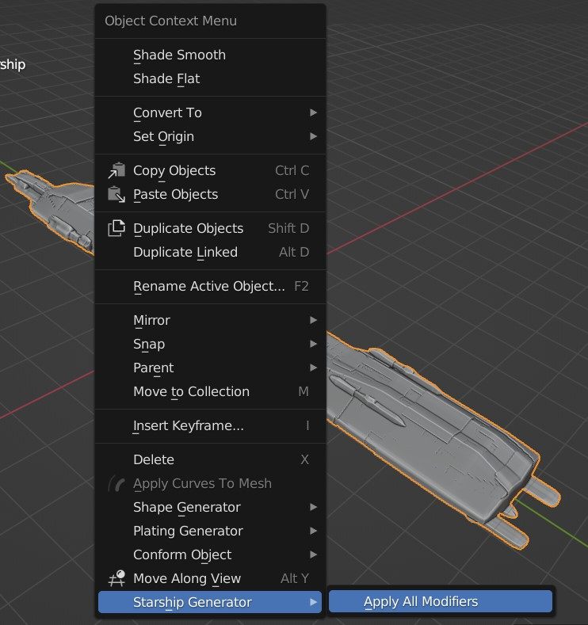

######################
How Tos
######################

****************************************************
Apply all modifiers at once
****************************************************

With the *Starship* object selected, in the viewport right-click for the object context menu.  Select *Starship Generator -> Apply all Modifiers*.  All modifiers will then be applied, which can take some time to process.

****************************************************
Export to Unreal Engine or other applications
****************************************************

Export the object and its procedural textures to another application such as Unreal Engine.

****************************************************
Use Custom Objects
****************************************************

Make the *Starship* use your own objects instead of the default ones.

****************************************************
Use Procedural Displacement for Panels
****************************************************

Get more detail onto the Starship by adding procedural displacement to your model. 

****************************************************
Add Windows to the Material
****************************************************

Apply a pattern of windows to the side of the starship all in the same material.

****************************************************
Dealing with Islands
****************************************************

Delete stray object islands that can occur on the generated *Starship*.