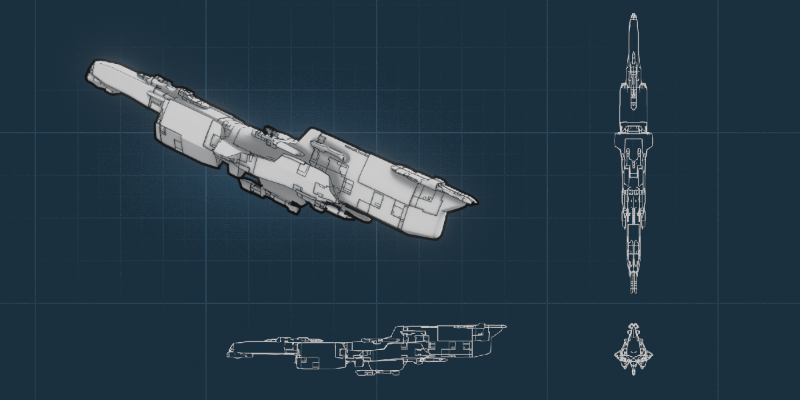

.. Starship Generator documentation master file, created by
   sphinx-quickstart on Mon Aug  8 13:37:25 2022.
   You can adapt this file completely to your liking, but it should at least
   contain the root `toctree` directive.

The Starship Generator
==============================================

---------------------------------
What is the |Starship Generator|?
---------------------------------

|overview_video|

.. |overview_video| raw:: html

    
<iframe width="560" height="315" src="https://www.youtube.com/embed/enFm2ja7T2k" title="YouTube video player" frameborder="0" allow="accelerometer; autoplay; clipboard-write; encrypted-media; gyroscope; picture-in-picture" allowfullscreen></iframe>

Add random scifi spaceships to your scene in |Blender| and export them to applications such as Unreal Engine.  For concept artists and game developers who wish to create background 3D models for use in art, animation, games, or as a source of inspiration.

.. |Blender| raw:: html

   <a href="https://www.blender.org/" target="_blank">Blender</a>

.. |Starship Generator| raw:: html

   <a href="https://store.configurate.net/l/starship-generator" target="_blank">Starship Generator</a>

---------------------------------
Features
---------------------------------

* Simply add a *Starship* model to your scene from Blender's *Add -> Mesh* Menu.
* Create different designs by changing a single seed number.
* Customize the Geometry Nodes set up in Blender: no custom code.
* Choose panels added to the 3D model or an included Cycles displacement material.
* Change the material and increase or decrease object density.
* Collapse all the modifiers for a regular 3D model.
* Created with design theory in mind to ensure the shapes are visually appealing.
* Look at example .blend file setups provided.

---------------------------------
How-to Videos
---------------------------------

|Full Video Playlist| featuring:

.. |Full Video Playlist| raw:: html

   <a href="https://youtube.com/playlist?list=PL6nzENCWkPwefcyBpUrAXB5tBzzZC2yc1" target="_blank">Full Video Playlist</a>

* |Use the built in displacement material| instead of 3D panels.
* |Export the model| into other 3D applications such as Unreal Engine. See this video.
* |Add your own objects| instead of the built-in ones.
* |Use the Blender Remesh modifier| to create a watertight model for 3D printing or sculpting. See this video.

.. |Add your own objects| raw:: html

   <a href="https://youtu.be/VtBm5XglIyM" target="_blank">Add your own objects</a>

.. |Use the built in displacement material| raw:: html

   <a href="https://youtu.be/-FDTCy_HFdE" target="_blank">Use the built in displacement material</a>
   
.. |Export the model| raw:: html

   <a href="https://youtu.be/qpPGVm8Mo_k" target="_blank">Export the model</a>

.. |Use the Blender Remesh modifier| raw:: html

    <a href="https://youtu.be/s-eBHlwMZ-8" target="_blank">Use the Blender Remesh modifier</a>

---------------------------------
Caveats
---------------------------------

* The add-on can not create *any* type of spaceship imaginable; it is focused on creating ships similar to the |Sulaco| from Aliens or the |Rocinante| from The Expanse.
* Best used for medium/background shots unless further modelling and sculpting is applied.
* Designed to be as fast as possible, but performance will vary from computer to computer when changing parameters.
* May cause the need to spend hours clicking through the seed values just to see which designs you get.

.. |Sulaco| raw:: html

    <a href="https://avp.fandom.com/wiki/USS_Sulaco" target="_blank">Sulaco</a>

.. |Rocinante| raw:: html

    <a href="https://expanse.fandom.com/wiki/Rocinante_(TV)" target="_blank">Rocinante</a>

---------------------------------
Use Royalty-Free
---------------------------------
You are welcome to use the Starship Generator in any of your work, commercial or otherwise.  We'd love to hear how you are using it!

---------------------------------
Questions or Comments?
---------------------------------
Don't hesitiate to contact us with any issues by clicking the 'Ask a Question' button on Blender Market or by emailing info@configurate.net.

.. toctree::
   :maxdepth: 2
   :caption: Contents:

   installation
   quick_start
   controls
   how_tos
   troubleshooting
   contact

