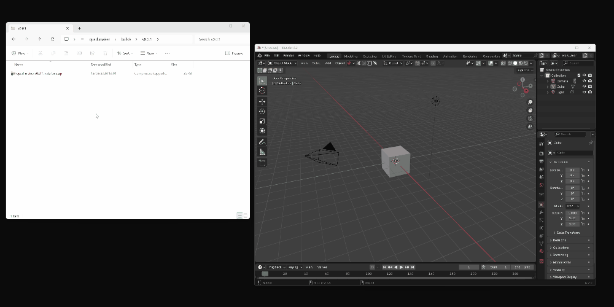
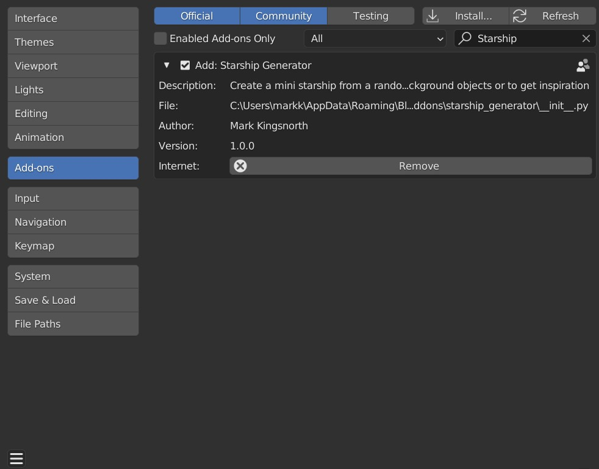

#############
Installation
#############

---------------------------------
Blender 4.2 and above
---------------------------------

Drag and drop the installation zip file into Blender to install the add-on.  

If you have any issues do not hesitate to get in touch via `info@configurate.net <mailto:info@configurate.net>`_.

---------------------------------
Blender 4.1 and below
---------------------------------

|install_video|

.. |install_video| raw:: html

    <iframe width="560" height="315" src="https://www.youtube.com/embed/8MUzwM9OvMw" title="YouTube video player" frameborder="0" allow="accelerometer; autoplay; clipboard-write; encrypted-media; gyroscope; picture-in-picture" allowfullscreen></iframe>

#. Go to *Edit* -> *Preferences*.
#. Select the *Add-ons* tab on the left if it is not already.
#. Select the *Install...* button along the top.
#. This will open a file dialog. Navigate to where you have downloaded the **starship_generator.vX.X.X.install_me.zip** file.  Do not unzip this file.
#. Then, click the *Install add-on from file* button.
#. Search for the add-on by typing *Starship Generator* in the search box if it does not already appear.
#. Make sure the checkbox next to the Add-on (*Add: Starship Generator*) is ticked:

If you have any issues do not hesitate to get in touch via `info@configurate.net <mailto:info@configurate.net>`_.