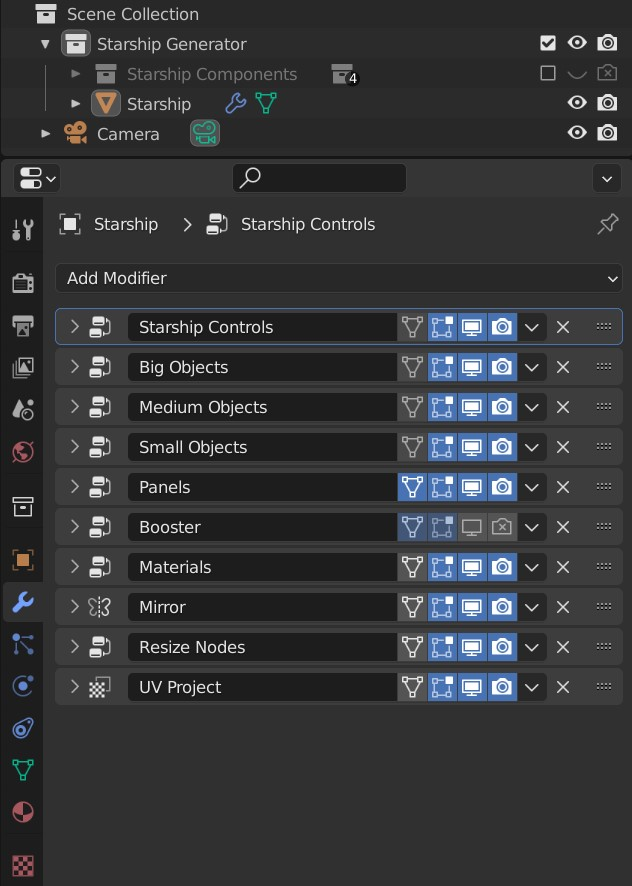
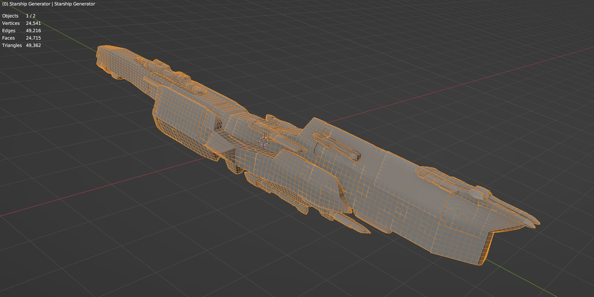
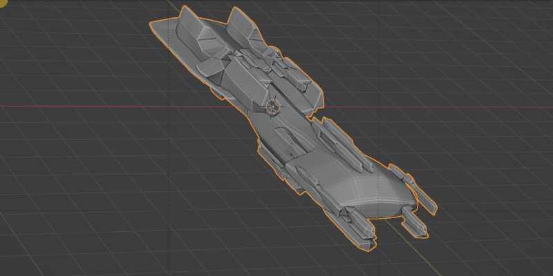
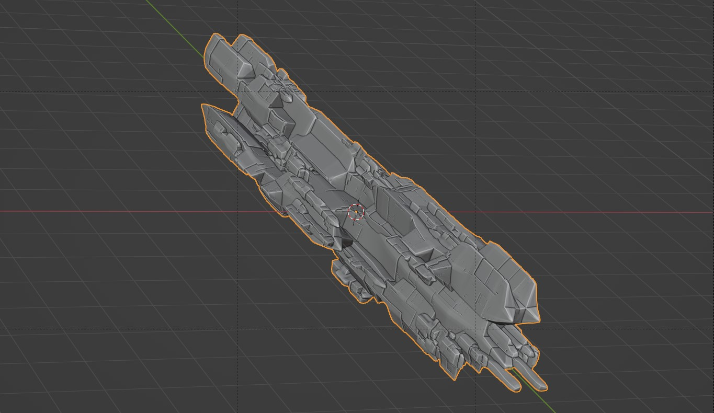
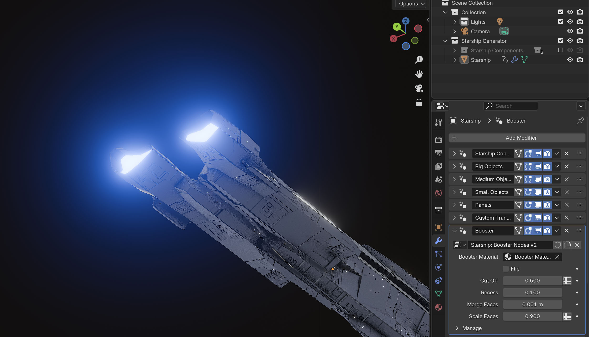
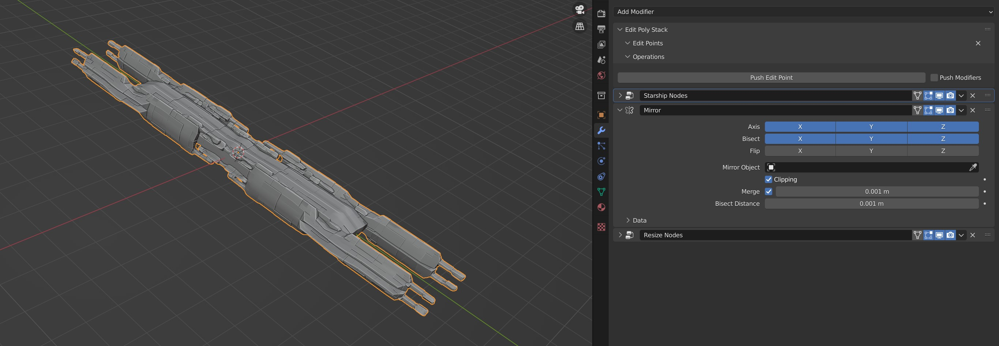

######################
Parameters
######################

Click on the *Starship* object to select it, and navigate to the *Modifiers* tab.  You'll see a set of modifiers that are used to generate the object:

#. A :ref:`Starship Nodes Modifier<Starship Nodes modifier>`

    This grabs the random objects created in the hidden *Starship Components* collecton and assembles them into the starship object.  These are where most of the parameters you control are.  It is backed by a Blender |Geometry Nodes| setup.

#. A :ref:`Mirror Modifier<Mirror modifier>`

    This controls the symmetry of the starship once it has been assembled.

#. A :ref:`Resize Nodes Modifier<Resize Nodes modifier>`

    This automatically scales the starship to a specified size.

Here is a screenshot of the modifiers list:

.. |Modifiers| raw:: html

   <a href="https://docs.blender.org/manual/en/latest/modeling/introduction.html" target="_blank">Modifiers</a>

.. |Geometry Nodes| raw:: html

   <a href="https://docs.blender.org/manual/en/latest/modeling/geometry_nodes/index.html" target="_blank">Geometry Nodes</a>

**********************************
Starship Nodes modifier
**********************************

This is where the main parameters are to control the starship:

Each parameter is described below:

Seed
======

This is a number that controls the overall random generation of the entire object.  Changing this number changes the entire starship configuration.

Material
==================

This changes the overall material for the object.  A *Default Material* is applied which you can alter in Blender's *Shading* section, or you can change to another material.

Big Objects/Medium Objects/Small Objects
========================================================================

These settings control which Blender *Collections* the Starship Generator uses to assemble the parts of its shape, separated by size.  If you change these settings, you may wish to switch of the :ref:`Panel effect<Big Object Panels/Medium Object Panels/Small Objects Panels? (0/1)>` that is applied to these objects when they are used.

.. note::

    .. image:: images/big_medium_small_example.gif

    The Starship Generator first randomly selects a *Big* object, then randomly chooses a set of *Medium* objects and scatters them around the *Big* object's surface, and then randomly chooses a set of *Small* objects and scatters them across the surface.  It then optionally adds a panelling effect to all the objects (switched on by default).

Shade Smooth? (0/1)
====================================

This controls whether smooth shading is applied after the object is assembled (1=activated, 0=deacvtivated).  Switching the shading to 0 will use the original *Big* objects shading settings.

Medium Object Density/Small Object Density
======================================================

These parameters control the amount of *Medium* and *Small* objects that are scattered across the surface.

Random Rotate? (0/1)
======================================================

If switched to 1, the *Medium* and *Small* objects will be randomly rotated at 90 degree increments along the Y axis to give extra variation. 0 disables this.

Medium Objects Min Scale/Medium Objects Max Scale
======================================================

This controls the minimum and maximum scale of the medium objects.

Small Objects Min Scale/Small Objects Max Scale
======================================================

This controls the minimum and maximum scale of the small objects.

Object Subdivisions
======================================================

   Object Subdivisions = 1

.. figure:: images/subdivisions_2.jpg
   :width: 100%

   Object Subdivisions = 2

To produce a smoother result in the shapes, subdivision is used.  Increasing this number will make the object look smoother at the expense of computation time.  It is not recommended to go above 3 subdivisions. If custom objects are used, this value will be ignored.

.. tip::
    If you want to quickly cycle through seed numbers to find a shape you like, setting the *Object Subdivisions* to zero will speed up computation time.  When you are happy with the overall shape, you can always increase the number of subdivisions afterwards.

Subdivision Min Crease/Subdivision Max Crease
======================================================

When subdividing the *Starship* object with :ref:`Object Subdivisions`, random |edge creasing| is applied to the sharper edges to give the overall shape more variation in its form. If custom objects are used, this value will be ignored.

.. |edge creasing| raw:: html

   <a href="https://docs.blender.org/manual/en/latest/modeling/modifiers/generate/subdivision_surface.html#modifiers-generate-subsurf-creases" target="_blank">edge creasing</a>
   
Object Min Extrusions/Object Max Extrusions
======================================================

   Extrusions = 1

.. figure:: images/high_extrusions.jpg
   :width: 100%

   Extrusions = 2

This controls the complexity of the underlying extrusions of the default objects.  These are advanced parameters where higher values increases complexity and can break aesthetics. If custom objects are used, this value will be ignored.

Object Min Taper/Object Max Taper
======================================================

This controls the tapering of the enderlying extrusions of the default objects. These are advanced parameters where different calues can break aesthetics. If custom objects are used, this value will be ignored.

Object Min Proportions/Object Max Proportions
======================================================

This controls the minimum and maximum proportions of the default objects.  If custom objects are used, this value will be ignored.

Big Object Panels/Medium Object Panels/Small Objects Panels? (0/1)
============================================================================================================

   Turning panelling on and off.

This turns on and off the panelling effect that is applied to the objects that make up the *Starship* (1=Active, 0=Disabled).

.. note::

    When using custom object collections or material displacement, you will likely want to switch off this panelling effect.

Panel Scale
======================================================

This is the size of the panels.  Larger values actually result in smaller pattern details, where smaller values increase the overall size.

Panel Subdivisions
======================================================

In order to apply the panelling effect, the object faces need to be subdivided so there is enough information to work out the pattern.  Increasing this value will increase the accuracy and smoothess of panels at the expense of calculation time when changing the object.

.. tip::

    **Jagged Panels**

    .. image:: images/jagged_panels.jpg
    
    At times, jagged panelling can occur at the corner of objects due to the way panels are created using 3D noise.

    You can improve this by increasing the number of *Panel Subdivisions*, but at the expense of calculation time:

    .. image:: images/jagged_panels2.jpg

Large Panel Height/Mid Panel Height/Micro Panel Height
============================================================================================================

These parameters control the relative heights of big, medium and smaller panel areas.

Panel Proportions
======================================================

This stretches the panels in the X, Y and Z axis.  A smaller Y value, for instance, will stretch the panelling effect in that direction.

Animate Seed? (0/1)
======================================================

If set to 1, this will change the seed for the overall Starship shape on each frame.  This is useful when wishing to iterate through many different designs in an animation.

Use Original Materials? (0/1)
======================================================

This will prevent the default :ref:`Material` from overriding any materials on the original source Big/Medium/Small objects.

Booster Objects
======================================================

Optionally, you can randomly apply a collecton of booster objects to the rear of the *Starship* (set this to the *Booster Objects* collection for the default). This is disabled by default as it assumes you will wish to use your own custom design in a collection or add this extra detail when the shape is finished.

Booster Min Scale/Max Scale
======================================================

The random minimum and maximum size when creating the booster.

Flip Booster? (0/1)
======================================================

Flip the booster in the opposite direction.

************************************************************
Mirror modifier
************************************************************

    The Starship mirrored in all directions.

.. figure:: images/mirror_modifier_none.jpg

    The Starship with no mirror.

This is a standard Blender *Mirror* modifier made to make the Starship look symmetrical.  Choose to disable this or mirror in more directions.  Remember to also select the *Bisect* axis when mirroring which will split the object.

**************************************************************
Resize Nodes modifier
**************************************************************

This modifier scales and centers the generated *Starship* object so that it is always at a set size.  The *Length* parameter is the size of the *Starship* object in the Y axis.

Like the :ref:`Starship Nodes modifier`, it is backed by Blender's |Geometry Nodes| framework.