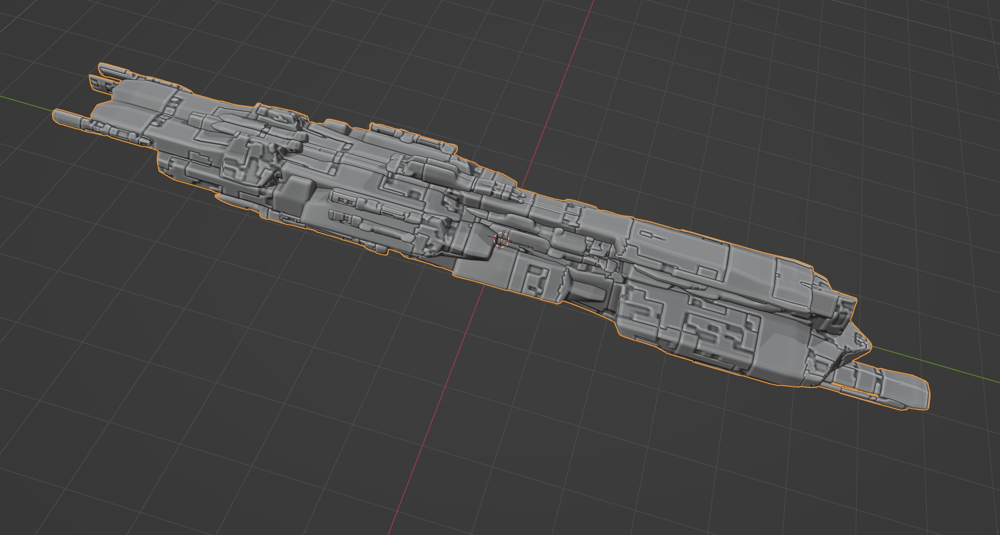

######################
Troubleshooting
######################

Here are some common issues you may come across: do :ref:`get in touch<contact>` if you have any questions.

********************************************************************************************************************************
When I duplicate the Starship it changes when I alter the original
********************************************************************************************************************************

.. image:: images/dupe_object.jpg

When duplicating the starship object in Blender, it is always best to simply go to the *Add* menu again and select *Mesh* then *Starship*. This cleanly creates a new Starship every time.  

Because of the way the Starship Generator uses Drivers to manage its configuration, duplicating the object by pressing *shift-d* or *ctrl-c* keeps the original drivers on the same object. This causes the original starship to essentially control the other.

********************************************************************************************************************************
Very Smooth Mesh
********************************************************************************************************************************

When changing the source objects the *Starship Generator* works with, you may sometimes see this effect where edges are overly smooth and switching off *Shade Smooth* does not help.  This is because the *Starship Generator* object inherits the smoothing settings from whichever *Big* object it first chooses.  By default, the *Big* objects have *Auto Smooth* activated, which should automatically sharpen hard edges.  

You can rectify this in two ways:

#. Add an *Edge Split* modifier to the *Starship* object.  This will split any sharp edges, although it does duplicate geometry along the edges.

    .. image:: images/edge_split.jpg

#. Activate *Auto Smoothing* on your object. Go to the *Big* object's *Object Data Properties* tab, go to the *Normals* section, and tick *Auto Smooth*:

    .. image:: images/auto_smooth.jpg

********************************************************************************************************************************
Jagged Edges on the Pattern
********************************************************************************************************************************

.. image:: images/jagged_panels.jpg

The panelling is generated using procedural noise and can produce a jagged effect on close-up, especially on the corners of a model.  To reduce this, look at decreasing or increasing the subdivisions on the object: See the note in the :ref:`Panels Modifier`.

********************************************************************************************************************************
Islands of disconnected shapes
********************************************************************************************************************************

.. image:: images/islands.jpg

Sometimes when generating a shape, the :ref:`Mirror modifier` will cause the reflected shape to produce islands of disconnected shapes.  This is an artefact of the generation process.  To remove the island will you need to collapse the *Starship* modifier and remove this shape by going into Edit mode, selecting the shape, and deleting. it.  See the How-To section on :ref:`dealing with islands`.