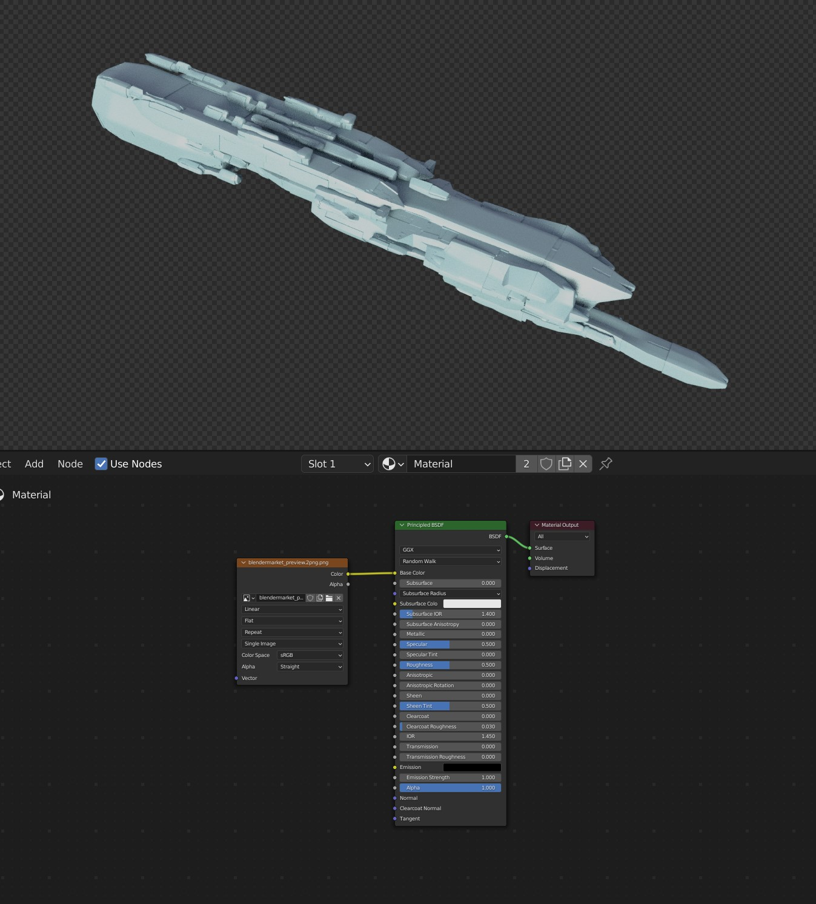

######################
Troubleshooting
######################

********************************************************************************************************************************
When I duplicate the Starship it changes when I alter the original
********************************************************************************************************************************

.. image:: images/dupe_object.jpg

Because of the way the Starship Generator uses Drivers to manage its configuration, duplicating the object by pressing *shift-d* or *ctrl-c* keeps the original drivers on the same object. This causes the original starship to essentially control the other:  It is recommended that you instead *Add* a new Starship instead, using the standard *Add Menu*.

********************************************************************************************************************************
Overly Smooth Mesh
********************************************************************************************************************************

TBD - either increase subdivisions or edge split.

********************************************************************************************************************************
Jagged Edges on the Pattern
********************************************************************************************************************************

The panelling is generated using procedural noise and can produce a jagged effect on close-up, especially on the corners of a model.  To reduce this, look at increasing the subdivisions on the object: See the :ref:`Panelling section<Panel Subdivisions>` in the parameters documentation.

********************************************************************************************************************************
Islands of disconnected shapes
********************************************************************************************************************************

.. image:: images/islands.jpg

Sometimes when generating a shape, the :ref:`Mirror modifier` will cause the reflected shape to produce islands of disconnected shapes.  This is an artefact of the generation process.  To remove the island will you need to collapse the *Starship* modifier and remove this shape by going into Edit mode, selecting the shape, and deleting. it.  See the How-To section on :ref:`dealing with islands`.

********************************************************************************************************************************
When I try and add a new texture, this is not displayed on the mesh.
********************************************************************************************************************************

    By default, no UV Map is created.

This is because, at the moment, the *Starship Generator* cannot automatically create a UV Map.  To manually create one, you will need to collapse the modifiers and add one using a method like |UV Smart Project|, or use the Texture Coordinate node and use the *Object* or *Generated* output if you are not exporting from Blender.  See the How-To section on :ref:`creating a UV Map<Add a UV Map>`

    The same set up but with a *Texture Coordinate* node introduced as an alternative.

.. |UV Smart Project| raw:: html

   <a href="https://docs.blender.org/manual/en/2.79/editors/uv_image/uv/editing/unwrapping/mapping_types.html#smart-uv-project" target="_blank">UV Smart Project</a>